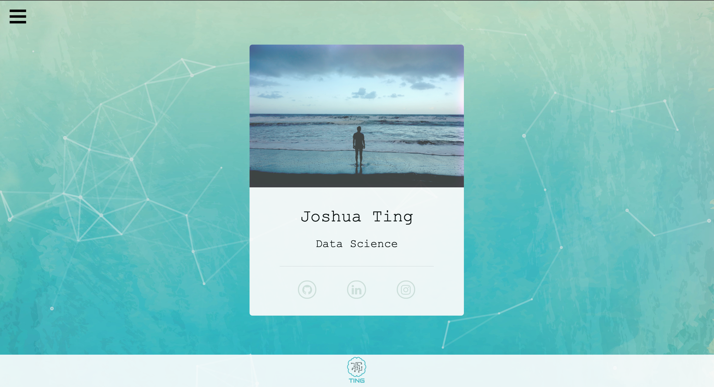
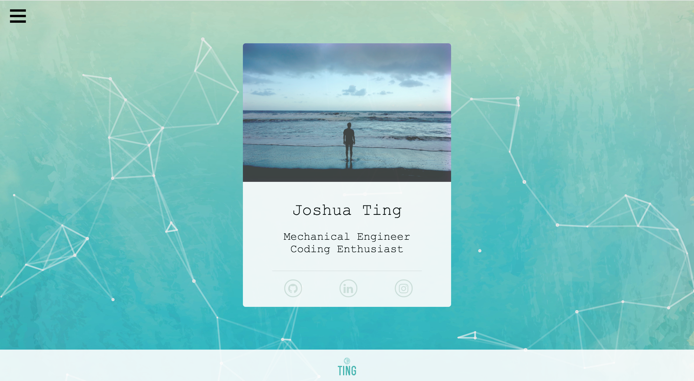

# Personal Website

## About

This contains all the resources and code for my personal portfolio website. The result is a fairly minimalistic and responsive personal website aimed to be both visually appealing and functional. This is the first real website that I have built from scratch all the way to deployment. There are definitely areas in my code that could be made more efficient (feel free to let me know). 

## Examples

Example Screenshot of Program:

Updated:


## Getting Started

This website utilizes fairly standard **HTML5**, **CSS3**, and **JavaScript** languages. 

Packages/frameworks needed to run on local machine:
```
- Node.js
- NPM
- particles.js
- npmjs
```

### Installing

**If you already have Node.js / NPM installed, you can skip this section.**

I use a Mac so the following resources for installation will be Mac specific but the same idea can be applied for Windows.

**1.**

I used [Homebrew](https://brew.sh/) to manage all my installations on my Mac machine. 

**2.**

Installing [Node.js/NPM using Homebrew](http://blog.teamtreehouse.com/install-node-js-npm-mac):
Type the following in your terminal.
```
brew install node
```
Check installation:
Type the following in your terminal.
```
node -v
```
```
npm -v
```
**3.**

I also used [VincentGarreau's](https://github.com/VincentGarreau/particles.js/) >lightweight JavaScript library for creating particles.

In order to see this library in action on your browser, a live server will need to be running on your machine. I used a temporary live server with [npmjs](https://www.npmjs.com/package/live-server).

Installing npmjs globally:
Type the following in your terminal.
```
npm install -g live-server
```

## Set Up

To run a temporary live server:
Type the following in your terminal.
```
live-server
```

To end live-server:
```
ctrl z
```

## Deployment (Server & Back-end)

I used DigitalOcean's VPS to run Ubuntu 16.04. I then used the following to configure my server side and back-end services. 
```
- Django
- PostgreSQL
- Nginx
- Gunicorn
- Supervisord
```
DigitalOcean provides good server set up [guides](https://www.digitalocean.com/community/tutorials/how-to-set-up-django-with-postgres-nginx-and-gunicorn-on-ubuntu-16-04) on setting up a server serving Django apps. They also have good guides on setting up [LAMP](https://www.digitalocean.com/community/tutorials/how-to-install-linux-apache-mysql-php-lamp-stack-on-ubuntu-16-04) and [MEAN.js](https://www.digitalocean.com/community/tutorials/how-to-install-a-mean-js-stack-on-an-ubuntu-14-04-server) stacks. These guides were great starting points to understand the basics before I dived more in depth into different set ups and configurations.

## Acknowledgments

I must tip my hat off to owners of any code, frameworks, media used that I do not own.
